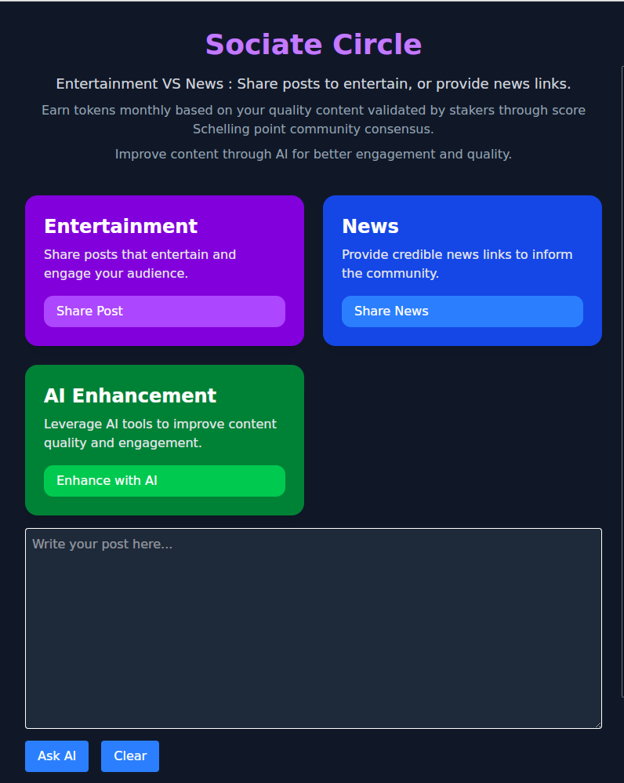

# News vs. Entertainment on Sociate Circle
  

Sociate Circle provides two distinct spaces for content: **Entertainment** and **News**. Users can share posts to entertain or provide news or academic links for informational purposes. This separation helps ensure that entertainment stays engaging while news remains credible.  

### Earn Rewards for Quality Content  

Users earn tokens monthly based on the quality of their content. This is validated by stakers using a **score Schelling point** consensus, where the community collectively determines content value. To improve engagement, users can leverage **local AI** for content refinement, ensuring better reach and interaction.  

### Combating Media Manipulation and Fake News  

Today, corporate-controlled news channels shape narratives, while social media platforms suffer from **Sybil attacks** that amplify fake news. Sociate Circle tackles these issues with **a decentralized, stake-based validation system**, ensuring a more trustworthy and democratic content ecosystem.  

### How Staking Works  

Users stake tokens and vote on posts with a **1-5 rating system**. The incentives for content creators are distributed based on the **average score** received from stakers. This mechanism encourages thoughtful content creation while preventing spam or misinformation.  

### Decentralized Moderation  

Moderation is **decentralized**, with moderators selected using the **seq-phragmen algorithm**. This ensures that content is reviewed fairly and in real time, preventing illegal or harmful material from spreading.

### Platform to Use
The platform will use Tauri for mobile and desktop apps, and Subxt, Substrate, and Leptos for the front end. 

